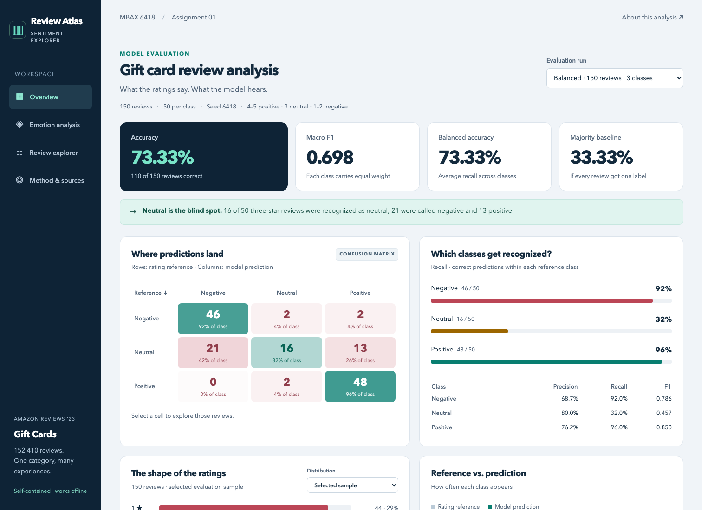
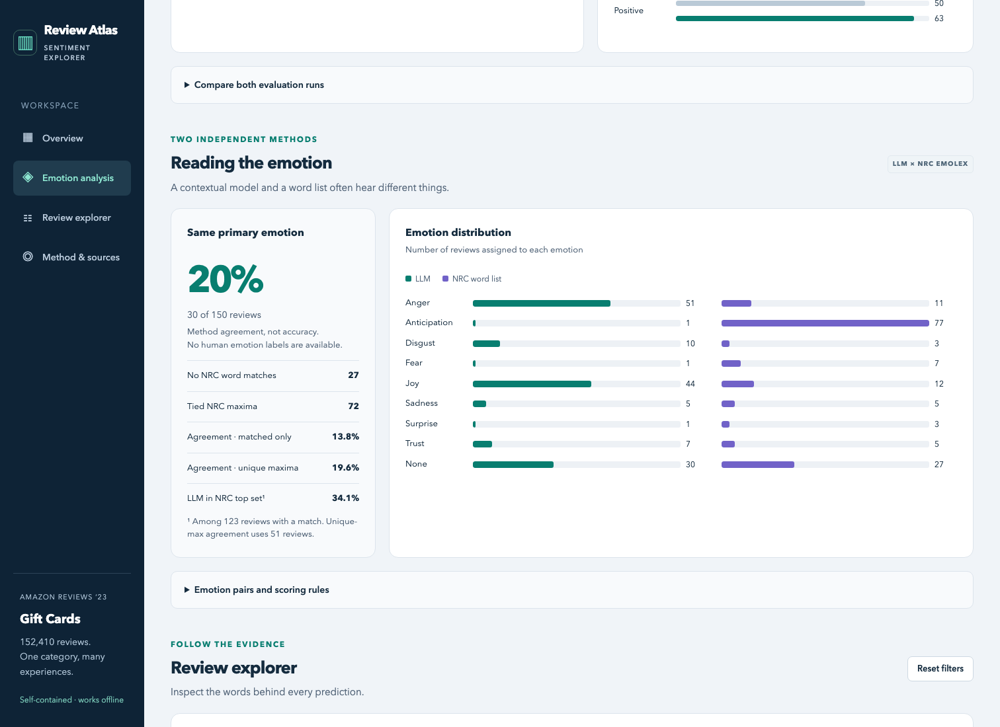
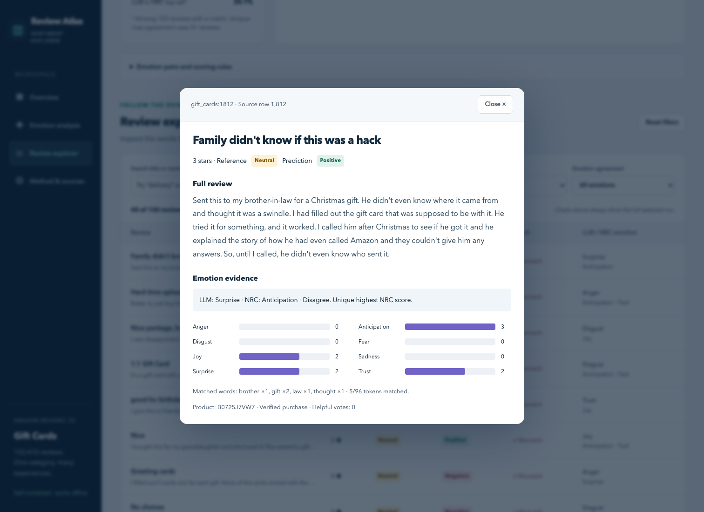

# Amazon Gift Cards: Sentiment and Emotion Analysis

**Status: Dashboard and analysis completed and browser-verified; student review and Canvas submission remain pending.**
This is an agent-generated evidence draft. The student must check the saved outputs and revise
the interpretations in their own words before submission.

## Dashboard

Repository: [Jade31413/MBAX6418-Assignment-01](https://github.com/Jade31413/MBAX6418-Assignment-01).

Open [dashboard.html](dashboard.html) locally in a browser. The complete dashboard is one
self-contained file with no CDN, server, API key or internet connection required.
GitHub normally displays HTML as source; download the file and open it locally to use it.







Switch between the balanced and first-100 runs; click any confusion-matrix cell to inspect
its reviews. Search or combine correctness, reference, prediction and emotion-agreement
filters. Review titles open the full text, emotion scores and matched words. Charts remain
scoped to the selected run while review filters change only the table.


## Scope and reproducibility

Use the [Amazon Reviews '23 dataset](https://amazon-reviews-2023.github.io/),
Gift Cards review category, collected by the McAuley Lab at UC San Diego.
[Download the source data](https://mcauleylab.ucsd.edu/public_datasets/data/amazon_2023/raw/review_categories/Gift_Cards.jsonl.gz).
The local file contains **152,410** reviews; **134,940**
are rated 4–5 stars (88.54%).
See [sampling manifest](data/prepared/sampling_manifest.json) for full population counts,
the source SHA-256, selected row IDs and the seed (**6418**).

The binary baseline uses the first 100 rows, with 4–5 stars positive and 1–3 stars negative.
The final run uses a uniform reservoir sample of 50 reviews per reference class from the
entire file: 1–2 negative, 3 neutral, 4–5 positive. Sampling is without replacement within
each class, using independent fixed random streams; 0 review IDs overlap the two runs.
The initial four smoke checks use synthetic examples, not evaluation data.

The course endpoint is `http://dobolyi.com:9001/v1`, model
`cyankiwi/Qwen3.6-35B-A3B-AWQ-4bit`. Python uses OpenAI-compatible Chat Completions,
temperature 0, top-p 1, seed 6418, JSON output and disabled thinking. Only title and text
are sent to the model; numeric rating and other metadata remain local. Titles may naturally
contain words such as “Five Stars”; supplied title text is retained as instructed.
Prompts handle conflicting title/body, short reviews, negation and mixed evaluations.
The sentiment-only prompt is spot-checked, then extended to emotion for the 100-row run.
Each prediction's exact request, raw response, timestamps, attempts and model fingerprint
are retained in `outputs/<run>/raw_responses.jsonl`. Secrets are never recorded there.
When an output violates the allowed labels, a retry constrains the same prompt and review
with a strict JSON Schema enum. The record's top-level request is the initial request;
attempt-level requests record any schema-constrained retry. Predictions are never manually relabeled.

Fixed inputs/settings do not guarantee identical future outputs from a shared model server.
Recomputing metrics from the saved raw responses is deterministic; fresh inference may vary.
The runner resumes only missing rows and refuses to mix changed inputs or prompts with an existing run.

## What the two runs show

| Run | Reviews | Accuracy | Balanced accuracy | Macro F1 | Always-majority baseline |
| --- | --- | --- | --- | --- | --- |
| Sequential binary | 100 | 98.00% | 92.32% | 0.9232 | 93.00% |
| Balanced three-class | 150 | 73.33% | 73.33% | 0.6977 | 33.33% |

The first batch has 93 positive and 7 negative
reference labels. Its 98.00% accuracy exceeds the always-positive baseline of
93.00%, but the dominant positive class heavily influences that headline.
Negative recall is 85.71%, compared with
98.92% for positive reviews. This is evidence of performance
on this small sequential sample, not a population-wide estimate.

With equal class support, majority guessing falls to 33.33%,
and the neutral class becomes visible. The three-class run gets 110/150 correct.
**Both the sampling and the task change** (two labels become three, with a different prompt).
The accuracy difference cannot be attributed solely to balancing.

## Where mistakes go

Rows are rating-derived reference labels; columns are model predictions.

| Rating reference / predicted | NEGATIVE | NEUTRAL | POSITIVE |
| --- | --- | --- | --- |
| NEGATIVE | 46 | 2 | 2 |
| NEUTRAL | 21 | 16 | 13 |
| POSITIVE | 0 | 2 | 48 |

| Class | Support | Predicted | Precision | Recall | F1 |
| --- | --- | --- | --- | --- | --- |
| NEGATIVE | 50 | 67 | 68.66% | 92.00% | 0.7863 |
| NEUTRAL | 50 | 20 | 80.00% | 32.00% | 0.4571 |
| POSITIVE | 50 | 63 | 76.19% | 96.00% | 0.8496 |

Of 50 three-star reviews, **16** receive NEUTRAL, **21** NEGATIVE and
**13** POSITIVE. The observed neutral behavior is described by these counts,
rather than assuming in advance that neutral must collapse into one other class.

- NEUTRAL → NEGATIVE: **21** reviews.
- NEUTRAL → POSITIVE: **13** reviews.
- POSITIVE → NEUTRAL: **2** reviews.
- NEGATIVE → POSITIVE: **2** reviews.
- NEGATIVE → NEUTRAL: **2** reviews.
- POSITIVE → NEGATIVE: **0** reviews.

Example mismatches (selection: first five in source-line order; full text is in the saved review file):

| ID | Stars | Reference → predicted | Title | Text excerpt (first 220 chars) |
| --- | --- | --- | --- | --- |
| gift_cards:1812 | 3 | NEUTRAL → POSITIVE | Family didn't know if this was a hack | Sent this to my brother-in-law for a Christmas gift. He didn't even know where it came from and thought it was a swindle. I had filled out the gift card that was supposed to be with it. He tried it for something, and it  |
| gift_cards:12303 | 3 | NEUTRAL → NEGATIVE | Hard time uploading | Better to just buy the fortnights bucks on the system. These are harder to upload if your not in front of the device. |
| gift_cards:13299 | 3 | NEUTRAL → NEGATIVE | Nice package, boring card | I was disappointed because all the other cards I ordered looked festive and appropriate for the Christmas packaging, but this one is the standard plain Amazon gift card and does not have a $ amount written on it.  The ot |
| gift_cards:17899 | 3 | NEUTRAL → NEGATIVE | 1:1 Gift Card | It's a gift card with a 1:1 value.  Occasionally they'll give you $5 for the purchase of a gift card but outside of that what's the point.  Don't devalue your money. |
| gift_cards:19061 | 3 | NEUTRAL → POSITIVE | good for birthdays | I give this to friends or family on special days |

The assignment uses ratings as the evaluation reference. A text/rating mismatch does not always
mean the text interpretation is unreasonable: in the binary baseline, `gift_cards:99` says
“Very easy to use. I wish I knew about it earlier” but has three stars; it is negative under the
binary rating rule and the model calls it positive. Conversely, `gift_cards:18` has five stars
but describes a repeatedly missing gift note; the model calls it negative.
These examples illustrate a limitation of rating-derived reference labels, not grounds for
changing labels after seeing predictions.

## LLM versus NRC emotions

Use the [NRC Word-Emotion Association Lexicon (EmoLex)](https://saifmohammad.com/WebPages/NRC-Emotion-Lexicon.htm),
version 0.92, created by Saif M. Mohammad and Peter D. Turney at the National Research Council Canada.
Reference: Mohammad & Turney (2013), *Crowdsourcing a Word–Emotion Association Lexicon*,
Computational Intelligence, 29(3), 436–465.

The word-list method lowercases and tokenizes title plus body, sums matching token occurrences
over eight emotions, and selects the highest score. Repeated words count repeatedly. Ties use
alphabetical order, while retaining all tied labels. Zero emotional matches produce `none`.
The LLM can also use `none` when no emotion is supported. This is an abstention category,
not a ninth NRC emotion. Exact word matching has no stemming, negation or sarcasm handling.

In the balanced run:

- Primary-label agreement: **30/150 (20.00%)**.
- No NRC emotional matches: **27** reviews.
- Tied highest NRC scores: **72** reviews.
- Agreement among the **123** reviews with any NRC emotional match: **13.82%**.
- Agreement among the **51** reviews with a unique nonzero maximum: **19.61%**.
- LLM label in the NRC top-score set: **42/123 (34.15%)** among matched reviews.

| ID | LLM | NRC | NRC tied maxima | Matched terms |
| --- | --- | --- | --- | --- |
| gift_cards:1812 | surprise | anticipation | anticipation | brother (1), gift (2), law (1), thought (1) |
| gift_cards:4444 | joy | anticipation | anticipation, joy, surprise | gift (1), good (1) |
| gift_cards:5481 | anger | fear | fear, sadness | pain (2) |
| gift_cards:7443 | joy | none | none |  |
| gift_cards:7653 | joy | anger | anger, anticipation, joy, surprise, trust | money (1) |

These are **agreement statistics, not emotion accuracy**: there are no human emotion labels.
NRC measures context-free word associations, while the LLM interprets the review in context.
Polysemy, generic gift vocabulary, negation, sparse matches and deterministic tie-breaking
are plausible sources of divergence. The per-review matched terms and eight scores make
those explanations inspectable; they do not prove which method is correct.

## Working files

- `prompts/`: sentiment-only, binary-plus-emotion and three-class-plus-emotion prompts.
- `scripts/classify.py`: resumable model runner with strict output validation.
- `scripts/score.py`: scoring, confusion matrices and mismatch records.
- `scripts/add_emotions.py`: independent NRC analysis with no model calls.
- `scripts/prepare_dashboard.py`: dashboard data generator and reference filtering logic.
- `scripts/build_dashboard.py`: generates the standalone HTML from `dashboard/` sources and saved data.
- `dashboard.html`: final offline dashboard; `dashboard/` contains its HTML, CSS and JavaScript sources.
- `screenshots/`: captured desktop, review-detail and mobile views.
- `outputs/baseline/` and `outputs/balanced/`: raw responses, predictions, enriched reviews,
  metrics, emotion metrics and manifests.
- [Dashboard data](outputs/dashboard_ready/dashboard_data.json): all records and chart series.
- `outputs/dashboard_ready/tables/`: chart CSVs for both runs.
- [Dashboard handoff](DASHBOARD_HANDOFF.md): data contract and future browser acceptance checks.
- [Verification](outputs/verification.json): sampling, request, metric, matrix and filter audits.

Browser verification of this build: **passed**.
See [browser verification](outputs/browser_verification.json) for exact-build checks of metrics,
chart values, all 225 class/result/emotion filter combinations across the two runs, pagination,
search, empty states, review details, mobile layout and 200% text enlargement. The offline
browser check records zero external requests and zero runtime errors when it passes.

## Run locally

Python 3.9+ standard library only; there are no pip dependencies. Run from this directory.

```sh
# Download the source if it is not already present:
curl -fL 'https://mcauleylab.ucsd.edu/public_datasets/data/amazon_2023/raw/review_categories/Gift_Cards.jsonl.gz' -o data/Gift_Cards.jsonl.gz
# Download NRC locally for educational use (do not redistribute it):
python3 scripts/download_lexicon.py
# Set COURSE_API_KEY in the environment using the course-provided credential.
# Optional: COURSE_BASE_URL and COURSE_MODEL; see .env.example.
# The scripts read environment variables, not .env files automatically.
python3 scripts/run_pipeline.py --classify
```

To rebuild analysis from saved responses with no model calls:

```sh
python3 scripts/run_pipeline.py
python3 -m unittest discover -s tests -v
```

Offline full verification still needs the local original data and NRC lexicon.
The delivered HTML and dashboard data bundle are self-contained. Existing successful model responses
are reused; to intentionally make a new run, archive its output directory first.

To regenerate just the HTML from the existing dashboard data:

```sh
python3 scripts/build_dashboard.py
```

The optional development browser check requires Node.js and Playwright (Chromium installed):
`node tests/dashboard.browser.cjs`. It opens the local HTML with networking disabled and
saves screenshots plus the verification record. `PLAYWRIGHT_MODULE` can point to an existing
Playwright installation. After browser checks, run `python3 scripts/verify_outputs.py` and
`python3 scripts/build_report.py` to refresh this report's verification status.
Theme colors are centralized at the start of `dashboard/styles.css`.

## Issues and workarounds

- The initial sandbox could not resolve the course host. A permitted external-network execution
  reached it; authenticated requests then confirmed the exact model from the assignment.
- Lexicon zero hits and ties require explicit policies. Recording abstentions, all maxima and
  alternate agreement denominators prevents arbitrary tie-breaking from being hidden.
- A shared service can fail individual requests. The runner preserves successful raw responses,
  logs failed attempts, retries transient failures and resumes missing rows. Incomplete runs
  are rejected by the scoring stage rather than silently reducing the denominator.
- One observed invalid response used `disappointment` instead of an allowed NRC-aligned
  emotion label. Identical unconstrained retries repeated the invalid label; schema-constrained
  retries address this output-contract failure while retaining the failed response evidence.
- Browser QA checks that small nonzero bars stay visible and that the star-distribution selector
  uses the correct population/sample denominator. Review-table filters do not silently change
  the headline chart denominators.
- Visual inspection found the navigation highlight could lag behind the section on screen;
  section-position tracking fixed it. Native review dialogs support Escape and restore focus.
- Review text is rendered as text, and embedded JSON escapes script-closing characters.
  The dashboard loads locally without requesting fonts, libraries or model services.
